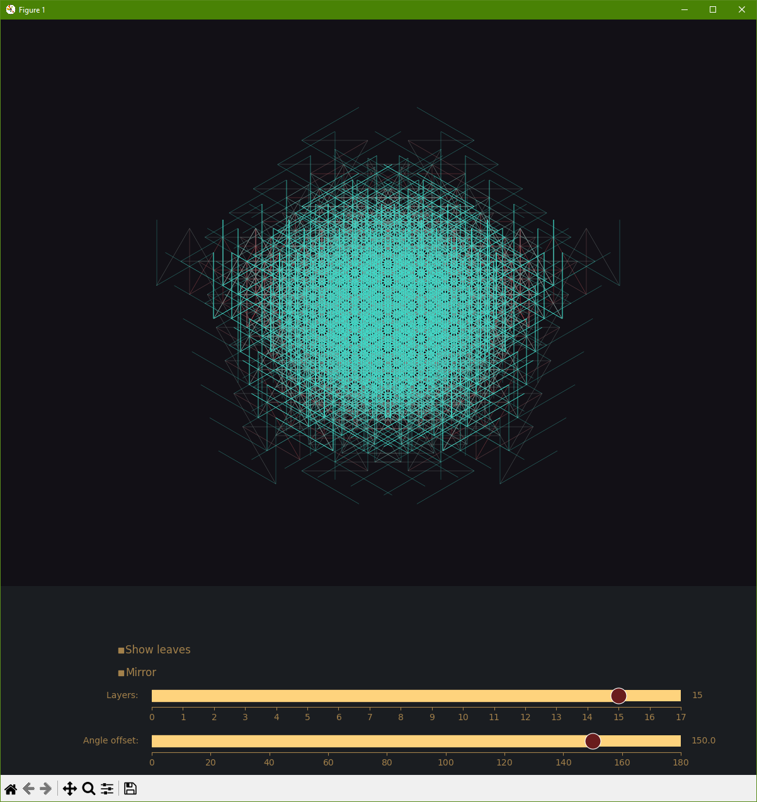

# Fractal Drawer

A fractal tree drawing app written in Python.

## Usage

To run, use `python3 app.py`

Once the program has started, use the sliders to control the number of layers of the tree and the angle offset of the branches.
Use the mirror checkbox to mirror the tree along the x-axis. Use the show leaf checkbox to mark the end of a branch chain.

## Dependencies
- Python 3.11
- matplotlib 3.7
- numpy 1.24

## Examples

